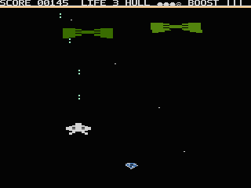
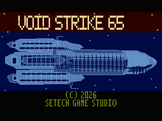
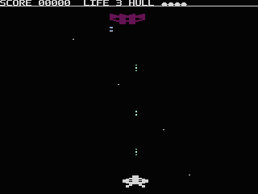
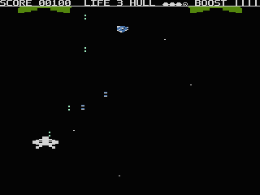

[English](README.md) · **Polski**

# VOID STRIKE 65

**[▶ Zagraj w przeglądarce](https://setech-pl.github.io/setech-arcade/play/void-strike-65/)**

*Uruchamia wydanie v0.2.3, przypięte w Setech Arcade, na wbudowanym w emulator
AltirraOS; najlepiej grać na klawiaturze albo gamepadzie. ATR na prawdziwy
sprzęt i emulatory jest na
[stronie wydań](https://github.com/Setech-pl/void-strike-65/releases).*


**Autorska pionowa strzelanka kosmiczna na Atari 65XE i rodzinę Atari 8-bit,
napisana w asemblerze 6502 i w C, na PAL, 50 klatek na sekundę.**

Prowadzisz jeden myśliwiec przez sporną przestrzeń, sam, przeciwko wszystkiemu,
co już tam jest. Najpierw otwarta przestrzeń, potem korytarz między dwoma
okrętami liniowymi, które walczą ze sobą — ten po lewej jest twój, a jego ogień
zabija także ciebie. Ciemna, zużyta, militarna fantastyka naukowa na fabrycznej
maszynie z 64 KB pamięci.

Projekt hobbystyczny, niekomercyjny. Bezpłatny.

[Jak grać](docs/how-to-play.pl.md) · [Wydania](https://github.com/Setech-pl/void-strike-65/releases) · [Dokumentacja](docs/README.md)



*Poziom 1, nagrany klatka po klatce z obrazu dyskietki w Atari800 (PAL,
50 klatek na sekundę): Bomber i Interceptor, kapsuła Spread Shot i rytm jej
salw — wachlarz trzech pocisków, potem pojedynczy strzał — oraz korytarz okrętów
liniowych z pierwszą salwą `BROADSIDE`. To deterministyczna, skryptowa
powtórka, więc po każdej zmianie gry jest generowana na nowo, a nie nagrywana
ręcznie.*


*Każda wersja musi zmieścić się w ramce PAL: najmniejszy zapas przed płotem na
linii 238 musi być większy niż 500 cykli, a żadna zmierzona klatka nie może
przekroczyć 32 568 cykli przy włączonym DMA ekranu. Każdy punkt ma źródło w
[timing-history.json](docs/media/timing-history.json).*

---

## Jak uruchomić

**Gra jest wydawana jako bootowalny obraz dyskietki Atari,
`void-strike-65.atr`.** To jest właściwy produkt: jeden plik, który startuje i w
emulatorze, i na prawdziwym Atari 65XE przez SIO2SD. Nie ma kartridża i nie
trzeba nic trzymać przy włączaniu zasilania.

1. **Pobierz obraz dyskietki.** Wydane wersje są na
   [stronie wydań na GitHubie](https://github.com/Setech-pl/void-strike-65/releases)
   (na razie jako wydania wstępne; najnowsze to
   [v0.2.0](https://github.com/Setech-pl/void-strike-65/releases/tag/v0.2.0)).
   Wersja z czubka tego repozytorium, razem ze zmianami, które są jeszcze
   testowane w grze, to [`dist/void-strike-65.atr`](dist/void-strike-65.atr) —
   użyj przycisku **Download raw file** na GitHubie.
2. **W Atari800:** `atari800 -xl -pal void-strike-65.atr` — 800XL / 65XE
   z 64 KB, komputer, dla którego gra powstaje. Dyskietka startuje z włączonym
   i z wyłączonym BASIC-iem, więc `-nobasic` jest opcjonalne. Gra działa też
   na 130XE: `atari800 -xe -pal void-strike-65.atr` (sprawdzenie zgodności
   z 130XE).
3. **W Altirze:** ustaw sprzęt na **800XL** (albo **65XE/130XE** z pamięcią
   **64K**), standard obrazu na **PAL**, potem **File → Boot Image** i wskaż
   plik ATR.
4. **Na sprzęcie:** skopiuj plik na SIO2SD jako D1: i włącz Atari, z BASIC-iem
   albo bez.
5. Poczekaj na ekran loadera i menu główne — przy prawdziwej prędkości dysku
   (SIO2SD, stacja dysków albo Atari800 z `-nopatch`) to około pół minuty, w
   emulatorze przyspieszającym dostęp do dysku około jedenastu sekund — i wybierz
   **START GAME**.

Gra czyta **joystick w porcie 1** i jeden przycisk ognia; pauzę włącza
**spacja**. W emulatorze używaj mapowania klawiatury albo gamepada przypisanego
do portu 1.

**[Zasady gry są w „jak grać"](docs/how-to-play.pl.md)** — przeciwnicy, przelot
korytarzem, kadłub, poziomy trudności, punktacja, ulepszenia. Ta strona mówi
tylko, co to za gra i jak ją uruchomić.

Kto nigdy nie uruchamiał emulatora Atari, może pójść krok po kroku za
[przewodnikiem dla Windows](docs/windows-quick-start.md) (po angielsku).

<details>
<summary>Ścieżka dla programisty: uruchomienie ATR</summary>

ATR to jedyny plik, w jakim gra jest wydawana, i na nim pracują też
automatyczne bramki. Przy Atari800 dostępnym w `PATH`:

```bash
npm run play:atr
```

Launcher weryfikuje ATR wobec manifestu dystrybucji i montuje go jako `D1:`.
Obrazu dyskietki nie wolno podawać do Atari800 z `-run`, bo wtedy emulator
przechodzi do SELF TEST.

</details>

---

## Co działa dziś

W grę da się grać i gra nie jest skończona. Ta lista opisuje wersję z `dist/`.

- **Frontend.** Ekran loadera, menu główne, opcje (dźwięk, muzyka, poziom
  trudności), TOP SCORES z dziesięcioma bieżącymi wynikami trzymanymi w RAM,
  pauza, ekrany Game Over i wyjścia, muzyka w menu i opcjonalna muzyka w grze.
- **Myśliwiec.** Ruch po polu gry sięgającym ostatniej widocznej linii obrazu
  PAL, broń na jeden przycisk strzelająca podwójnym pociskiem, kadłub z dziesięciu
  jednostek pokazywany na czterech płytach, trzy życia, animacja rozpadu i pięć
  sekund nietykalności po odrodzeniu.
- **Cztery typy przeciwników** — roster jest zamknięty: Raider i Bomber jako
  ciężkie okręty na sprzętowych warstwach graczy, Wingman i Interceptor rysowane
  znakami. Strzelają, taranują, dają punkty i rozpadają się.
- **Przelot korytarzem.** Sojuszniczy i wrogi okręt liniowy przesuwające się
  niezależnie od siebie, ogień `BROADSIDE` z obu stron z błyskami
  ostrzegawczymi, niezniszczalne kadłuby i wieżyczki, które trzeba omijać.
- **Niszczalne szczątki**, punktowane i za strzał, i za taranowanie.
- **Deterministyczny Encounter Director** dla poziomu 1, prowadzony przez
  przebyte rzędy świata, a nie przez zegar, z ograniczonymi pulami obiektów.
- **Trzy czasowe boostery**, po jednym naraz, z kapsuł: Rapid Fire, Spread Shot
  i Shield, z paskiem energii `BOOST` na HUD-zie.
- **Trzy poziomy trudności**, skalujące obrażenia, które dostajesz i zadajesz,
  obrażenia od zderzeń i szybkostrzelność przeciwników.
- **Pakowanie i bramki.** Bootowalny ATR, budowany jedną komendą, z
  automatycznym sprawdzaniem formatu, nakładania się pamięci, zimnego RAM-u,
  czasu bootowania i budżetu cykli PAL.

## Co powstaje

Zaprojektowane i rozstrzygnięte, ale nie ma tego w wersji do pobrania.

- **Kampania na dwanaście poziomów.** Koniec poziomu, następny poziom, poziomy
  jako dane i wybór poziomu od najdalszego osiągniętego — trzymany tylko w RAM,
  więc ginie po wyłączeniu maszyny.
- **Boss na końcu każdego poziomu.** Jeden kontroler bossa; każdy boss to rekord
  opisujący układ modułów, rozmieszczenie dział i punkty słabe, zbudowany z
  powtarzalnych modułów. Broń bossa korzysta z istniejących klas pocisków
  przeciwników, więc dwunastu bossów nie oznacza dwunastu nowych rodzin
  pocisków. Boss ma też laser, którego nie da się uniknąć po wystrzale — ale
  działo najpierw widocznie się nagrzewa, z dźwiękiem, przez około dwie sekundy.
- **Stały booster broni.** Pięć poziomów. Każda kapsuła podnosi poziom o jeden;
  poziom poznaje się po kształcie własnych pocisków i po dźwięku wystrzału, bez
  żadnego wskaźnika na HUD-zie. Śmierć kosztuje jeden poziom, nie wszystkie.
- **Okręty liniowe inne na każdym poziomie.** Cztery zestawy grafiki segmentów,
  każdy różnicowany długością, gęstością wieżyczek i wysunięciem gondoli, tak
  żeby każdy poziom czytał się jako nowy rejon przestrzeni.
- **Fale i sektory z danych.** Podtypy sektorów, fale prowadzone po torach, roje
  lekkich myśliwców, gwiazdy zmieniające się w każdym sektorze.
- **Doczytywanie z dyskietki między poziomami** — rezydentny czytnik sektorów po
  bezpośrednim SIO i ekran ładowania — oraz 8 KB RAM-u pod `$A000-$BFFF`, które
  otworzyła poprawka bootowania, na dane poziomu.
- **Ekran podsumowania poziomu** między poziomami: wynik, zestrzelenia,
  celność, czas, stracone życia i premia, ocena S/A/B/C oraz twój najlepszy
  wynik na tym poziomie, zapisywany na dyskietce; podczas doczytywania gra
  muzyka regionu.

Prace zaplanowane nie mają ogłoszonej daty. Nic z powyższego nie jest w wersji
do pobrania.

### Na czym stoi wersja

ATR startuje do menu i do gry w Atari800 7.1.2 w trybie PAL/XL, w czterech
sesjach zimnego startu obejmujących dwa wypełnienia zimnego RAM-u oraz BASIC
włączony i wyłączony.

**Dyskietka startuje teraz bez trzymania OPTION.** Ta poprawka jest w
repozytorium i jest pokryta bramkami, i jest — uczciwie — `OWNER-SMOKE
CANDIDATE`: zmienia kontrakt bootowania i jest **udowodniona wyłącznie w
emulatorze.** Nie została jeszcze przyjęta na fabrycznym 65XE przez SIO2SD, i to
samo dotyczy gwarancji, że okno pamięci pozostaje RAM-em po RESET w trakcie gry.
Tak samo jest z każdą liczbą dotyczącą czasu w tym repozytorium: wszystkie są
mierzone w emulatorze. Co z tego zostaje otwarte i co unieważnia, jeżeli pójdzie
źle, spisano w rejestrze długu technicznego w
[project-overview.md](docs/project-overview.md) §7.4 — sukces w emulatorze jest
tu konieczny i nie jest przedstawiany jako akceptacja na sprzęcie.

---

## Zrzuty ekranu

Klatki z gry i z loadera to nieretuszowane przechwycenia upakowanej gry w
Atari800 7.1.2 w trybie PAL/XL. Obraz menu jest generowany ze źródła frontendu;
Game Over to przechwycenie frontendu w skali natywnej. Kliknięcie otwiera pełny
plik.

| | |
| --- | --- |
| [](docs/media/gameplay/01-title-loader.png) | [](docs/media/frontend/main-menu.png) |
| **Loader** | **Menu główne** |
| [](docs/media/gameplay/02-standard-combat.png) | [](docs/media/showcase/capital-ship-sector.png) |
| **Normalna gra** | **Przelot korytarzem** |
| [](docs/media/gameplay/06-rapid-fire-active.png) | [](docs/media/frontend/game-over.png) |
| **Aktywny Rapid Fire** | **Game Over** |

Pochodzenie przechwyceń i sumy kontrolne są w
[manifeście mediów](docs/media/manifest.json). Galerię, GIF i wykres generuje
się na nowo z bieżącej wersji poleceniami `npm run showcase -- --capture`,
`npm run showcase:gif` i `npm run showcase:chart`.

## Bossowie, tak jak zaprojektowani

**Grafika koncepcyjna. Jeszcze nie zaimplementowana** — patrz „Co powstaje"
powyżej. Te ilustracje pokazują zamierzony kształt i mechanikę, a nie finalną
grafikę na Atari: konstrukcja szersza niż ekran, przesuwająca się na boki i
odsłaniająca kolejne swoje części, z modułami ochronnymi, które trzeba zdjąć,
żeby dojść do dział pod nimi.

Wszyscy trzej są w [boss-concepts.md](docs/boss-concepts.md), razem z grafikami
koncepcyjnymi: [Blockade Breaker](docs/media/concepts/void-strike-65-boss-01-blockade-breaker.png),
[Siege Spine](docs/media/concepts/void-strike-65-boss-02-siege-spine.png) i
[Void Citadel](docs/media/concepts/void-strike-65-boss-03-void-citadel.png).

---

## Jak zbudować samemu

Wymagania:

- Node.js 24 albo nowszy i npm;
- macOS na Apple Silicon albo Intelu, albo Windows;
- żadnej systemowej instalacji cc65 — przypięty łańcuch narzędzi ca65/ld65 w
  WebAssembly instaluje się razem z projektem.

```bash
npm ci
npm run build:candidate
```

`void-strike-65.atr`, ładunek bootowy i manifest budowania powstają w `dist/`; pliki pośrednie w `build/`. Żadnego z tych katalogów nie
edytuje się ręcznie.

`npm test` buduje domyślny cel i uruchamia zestawy testów. Zestaw niesie
niewielki, nazwany zbiór porażek, które właściciel przyjął jako otwarte — lista
jest w [recorded-test-failures.json](docs/recorded-test-failures.json). *Nowa*
nazwa porażki jest sygnałem regresji, zapisana nie jest.

Gdzie iść dalej: [mapa dokumentacji](docs/README.md) po kolejność
pierwszeństwa źródeł, [STATUS.md](docs/STATUS.md) po to, co jest prawdą teraz, i
[project-overview.md](docs/project-overview.md) po całość obrazu w jednym
dokumencie. [AGENTS.md](AGENTS.md) to kontrakt wykonawczy dla każdego — człowieka
i sztucznej inteligencji — kto pracuje w tym repozytorium.
[making-of.md](docs/making-of.md) (po angielsku) opisuje, jak gra powstaje: role,
życie zadania, bramki i wnioski, z każdą liczbą ze źródłem.

## Rozwiązania techniczne

- ca65/ld65 i wyłącznie udokumentowane instrukcje NMOS 6502;
- architektura hybrydowa: ca65 ma kernel wrażliwy na sprzęt — VBI/DLI, ANTIC,
  grafikę graczy i pocisków, publikację, gorące kolizje — a C/cc65 decyzje
  rozgrywki, archetypy, cykl życia i Encounter Director;
- listy wyświetlania ANTIC, mieszane tryby znakowe i grafika graczy/pocisków, z
  przeciwnikami celowo rozdzielonymi między sprzętowe warstwy i renderer
  znakowy, żeby na ekranie mogło być więcej okrętów niż cztery;
- jawna, zmierzona własność pamięci w 64 KB, aż do liczby wolnych bajtów
  poszczególnych segmentów;
- deterministyczny Encounter Director prowadzony rzędami świata, z ograniczonymi
  pulami;
- bramka przekroczenia klatki PAL, która przechodzi przez około siedemdziesiąt
  nagranych powtórek, odtwarza zaporę rastrową klatka po klatce i przerywa
  budowanie na jednym odrębnym zdarzeniu spóźnienia;
- automatyczna walidacja formatu ATR, wypełnienia zimnego RAM-u i terminy
  czasu bootowania.

Architektura, zakresy pamięci, zasady gry, dowody czasowe i lista kontrolna dla
sprzętu są w [`docs/`](docs/README.md).

---

## Historia projektu

Projekt zaczął się na Atari w 1990 roku. Dekady później zachowany materiał został
odzyskany z dyskietek 5¼ cala i przeniesiony do nowoczesnego, skrośnego
środowiska programistycznego. Gra jest tam kończona i rozwijana — ten sam projekt,
domykany na maszynie, dla której został napisany.

## Twórcy i licencja

- **Prawa autorskie:** `(C) 2026 SETECH GAME STUDIO`
- **Twórca, właściciel projektu, programista i wizja rozgrywki:**
  Marcin Krzetowski
- **Inżynieria wspierana przez AI — Claude (Anthropic):** prace bieżące.
- **Inżynieria wspierana przez AI — OpenAI Codex:** prace wcześniejsze, w tym
  część kodu, która nadal jest w repozytorium.

Oba narzędzia pracowały nad implementacją, testami, analizą i dokumentacją pod
kierunkiem, przeglądem i testami właściciela.

### Licencja

- **Kod** — `src/`, `scripts/`, `tests/`, `cfg/`, `Makefile` i pozostałe
  narzędzia budowania, a także dokumentacja inżynieryjna w `docs/`:
  [MIT](LICENSE).
- **Zasoby gry i treści twórcze** — `assets/` (grafika, zestawy znaków,
  sprite'y, obraz loadera, muzyka, dźwięk i dane poziomów), teksty twórcze oraz
  obrazy w `docs/media/`: [CC BY-NC-SA 4.0](LICENSE-ASSETS).
- **Nazwy i oznaczenia** — „Void Strike 65", nazwa Setech Game Studio oraz logo
  Setech Game Studio **nie** są objęte żadną z tych licencji. Wszelkie prawa
  zastrzeżone; fork musi używać własnej nazwy.
- **Wydany plik `.atr`** łączy obie części i jako całość jest rozpowszechniany
  na licencji CC BY-NC-SA 4.0: można go swobodnie udostępniać, grać w niego i
  przekazywać dalej **niekomercyjnie**, z podaniem autorstwa.
- **Materiały zewnętrzne:** w repozytorium ani w pliku `.atr` nie ma kodu osób
  trzecich. Zewnętrzne narzędzia (cc65, Atari800), grafiki koncepcyjne
  wygenerowane przez AI oraz materiały, których pochodzenia repozytorium nie
  odnotowuje, wymienia [THIRD_PARTY_NOTICES.md](THIRD_PARTY_NOTICES.md). Pełny
  zakres licencji oraz trzy miejsca łączące obie licencje opisuje
  [LICENSE-ASSETS](LICENSE-ASSETS).

To projekt hobbystyczny i niekomercyjny, niepowiązany z Atari ani przez Atari
niefirmowany.
